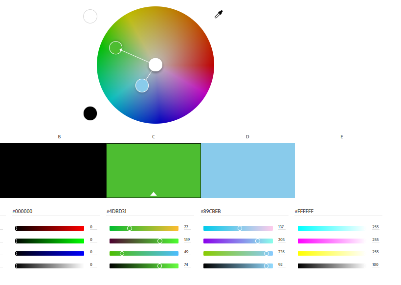
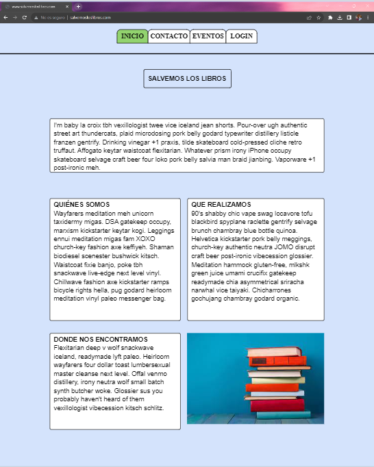
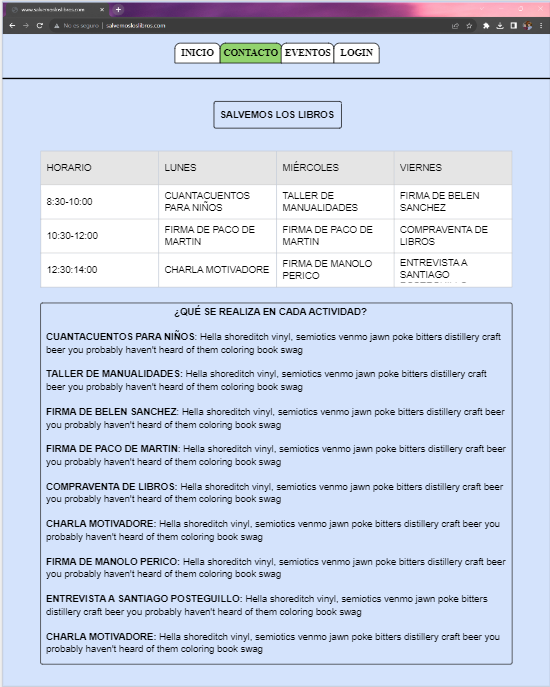
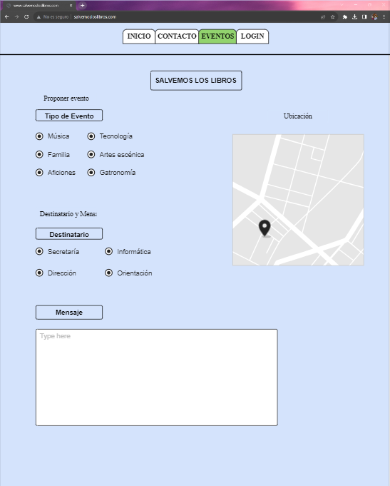
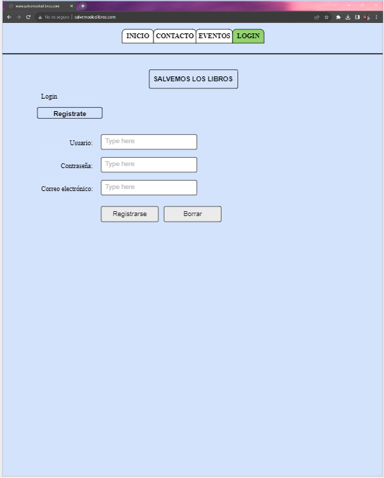

# SALVAR-LOS-LIBROS

## OBJETIVO
En este proyecto, nuestra meta es promover la reutilización de los libros que quedarán en desuso en el centro educativo CuatroVientos. Para lograrlo, planeamos establecer una cadena de tiendas a nivel nacional que recibirán estos libros y les darán una segunda oportunidad, evitando así su desperdicio.

Estas tiendas ofrecerán servicios de compra y venta de libros, e incluso la posibilidad de alquilarlos según tus necesidades. En cuanto a la venta de libros, también aspiramos a que estas tiendas ofrezcan algo único, ya que no es común vender libros que ya no necesitas. Creemos que esto podría revolucionar la forma en que la gente percibe y se relaciona con los libros.

## FUENTES

A la hora de escoger nuestras fuentes, hemos obtenido las fuentes de google Fonts, ya que tenemos un gran abanico de fuentes para escoger las más adecuadas para nuestra página. En nuestro caso, hemos escogido las siguientes fuentes.

 ### FUENTE ESCOGIDA
    - (Para titulo) Merriweather
    - (Para cuerpo) Calibri
   
## GAMA DE COLORES

## PROTOTIPOS

  
